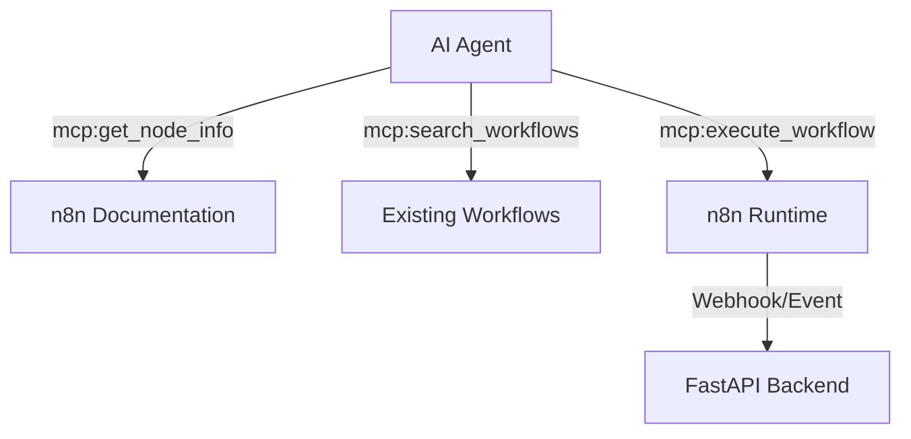

# n8n Workflow Engineering (Mode B)

This skill focuses on **Designing** and **Building** workflows, rather than just triggering webhooks.

## Architecture: Mode B (Workflow Orchestration)

AI agent uses MCP tools to discover n8n node capabilities and constructs JSON workflow definitions.

## Engineering Patterns

### 1. Node Discovery
Before suggesting a workflow change, ALWAYS verify the node's properties:
- Use `get_node_info` to check required parameters.
- Use `search_workflows` to find similar implementations.

### 2. Data Transformation (Expression Language)
n8n uses `{{ $json.field }}` or `{{ $node["NodeName"].json.field }}`. 
- Ensure pathing is correct relative to the preceding node.
- Prefer **Code Node** (JavaScript) for complex logic instead of multiple nested Core nodes.

### 3. Integration with FastAPI
- **Outbound**: Backend calls n8n (see `n8n-mcp-integration` skill).
- **Inbound**: n8n calls FastAPI REST API using the "HTTP Request" node.
- **Contract**: Ensure Pydantic models in `backend_python` match the JSON output of n8n HTTP nodes.

## Best Practices
- **Idempotency**: Ensure n8n workflows can handle retries safely (especially for payments/emails).
- **Validation**: Use a **Filter Node** immediately after a Webhook trigger to validate incoming data.
- **Logging**: Include a "Catch-All" node for error handling in production workflows.

> [!TIP]
> Use the `execute_workflow` tool during development to verify that the logic flows correctly before committing to a design.

> [!IMPORTANT]
> This skill is configured to work with the n8n instance at `https://apaxhud.app.n8n.cloud/mcp-server/http`.
