# 🔍 Architecture Review: Split-Stack Migration (Next.js ↔ Python)

## Analisi del Piano Attuale

### Flusso Architetturale

```mermaid
sequenceDiagram
    participant U as 👤 User (Browser)
    participant N as ⚡ Next.js API (Proxy/Auth)
    participant P as 🐍 Python API (The Brain)
    participant V as 🧠 Vector DB (Memory)
    participant G as 🤖 Vertex AI (Gemini)

    U->>N: Messaggio Chat + JWT
    Note over N: Valida Token Firebase<br>Rate Limiting
    N->>P: Forward Request (User Input + History)
    
    rect rgb(20, 20, 40)
        Note over P: Inizio Loop LangGraph
        P->>V: 🔍 Ricerca "Errori Passati" (RAG)
        V-->>P: Regole recuperate
        P->>G: Genera Risposta (Streaming)
        G-->>P: Stream Token
    end
    
    P-->>N: Stream Response
    N-->>U: Stream UI (Vercel AI SDK)
```


---

## 1. ⚠️ Stress Test & Validazione (3 Failure Points Critici)

### Failure Point #1: **Stream Protocol Mismatch**

**Problema**: Vercel AI SDK usa il Data Stream Protocol (formato `0:"text"\n` per text chunks). Se il backend Python risponde con un formato diverso (es. Server-Sent Events `data: ...` o JSON puro), il frontend si romperà silenziosamente.

**Soluzione Immediata**:
```python
# backend_python/src/streaming/vercel_adapter.py
from typing import AsyncIterable

async def to_vercel_protocol(chunks: AsyncIterable[str]) -> AsyncIterable[str]:
    """Converte stream generico in Vercel AI SDK Data Protocol."""
    async for chunk in chunks:
        # Escape quotes e newlines
        escaped = chunk.replace('"', '\\"').replace('\n', '\\n')
        # Formato: 0:"content"\n
        yield f'0:"{escaped}"\n'
```

**Validazione**: Creare test con un mock client Vercel AI SDK e verificare che `useChat` hook riceva i chunk correttamente.

---

### Failure Point #2: **Token Validation Latency & Firestore Amplification**

**Problema**: Ogni richiesta richiede:
1. Next.js valida il token Firebase (50-100ms)
2. Next.js inoltra a Python con il token
3. **Python ri-valida lo stesso token** (100-200ms + chiamata a Firebase Auth servers)

Questo introduce 150-300ms di overhead puro + 2 chiamate a Firebase per ogni messaggio.

**Soluzione Immediata** (Signed JWT Handoff):
```typescript
// Next.js route handler
import * as admin from 'firebase-admin';

async function createInternalJWT(firebaseToken: string) {
  const decoded = await admin.auth().verifyIdToken(firebaseToken);
  
  // Crea un JWT interno firmato da Next.js
  const internalToken = jwt.sign(
    { uid: decoded.uid, email: decoded.email },
    process.env.INTERNAL_JWT_SECRET!,
    { expiresIn: '5m' } // Short-lived
  );
  return internalToken;
}
```

```python
# Python backend - valida solo il JWT interno
import jwt

def verify_internal_token(token: str):
    return jwt.decode(token, INTERNAL_JWT_SECRET, algorithms=["HS256"])
```

**Risparmio**: Da 150-300ms a ~5ms (solo decrypt JWT).

---

### Failure Point #3: **Cold Start Cascade (Il Doppio Risveglio)**

**Problema**: 
- Vercel Edge Function dorme → Utente aspetta ~800ms wake
- Vercel si sveglia, chiama Python → Python Container su Cloud Run dorme → Altri 3-5s wake
- **Total First Request**: 4-6 secondi prima di vedere il primo token

**Soluzione Immediata** (Warm Pool Strategy):
```bash
# Cloud Run Deployment
gcloud run deploy syd-brain \
  --min-instances=1 \  # ⚠️ Costa ~$15/mese ma elimina cold start
  --max-instances=10 \
  --cpu-boost \  # Priorità CPU alta durante il boot
  --timeout=300
```

Alternative economiche:
1. **Scheduled Keep-Alive** (Gratis): Cron job che fa ping ogni 4 minuti per mantenere almeno 1 istanza calda.
2. **Progressive Feedback**: Next.js mostra immediatamente "SYD sta pensando..." mentre aspetta.

---

## 2. 📁 Repository Structure (Monorepo vs Split)

### Opzione Consigliata: **Monorepo con Workspace**

```
renovation-next/
├── package.json                    # Root workspace
├── .env.local                      # Shared secrets (FIREBASE_*, JWT_SECRET)
│
├── web_client/                     # Frontend (Next.js)
│   ├── app/
│   │   ├── api/
│   │   │   └── chat/
│   │   │       └── route.ts        # ⚠️ PROXY to Python
│   │   └── page.tsx
│   ├── components/
│   ├── hooks/
│   │   └── useChat.ts              # Vercel AI SDK
│   └── package.json
│
├── backend_python/                 # Backend (Python)
│   ├── pyproject.toml              # uv/poetry deps
│   ├── Dockerfile                  # Cloud Run
│   ├── main.py                     # FastAPI entry
│   │
│   ├── src/
│   │   ├── api/
│   │   │   ├── chat.py             # POST /chat/stream
│   │   │   └── learn.py            # POST /learn
│   │   │
│   │   ├── agents/
│   │   │   ├── graph.py            # LangGraph definition
│   │   │   └── nodes.py            # Agent nodes (RAG, Tools)
│   │   │
│   │   ├── tools/
│   │   │   ├── imagen.py           # generate_render
│   │   │   ├── perplexity.py       # get_market_prices
│   │   │   └── pricing.py          # Weighted RAG engine
│   │   │
│   │   ├── streaming/
│   │   │   └── vercel_adapter.py   # Stream protocol converter
│   │   │
│   │   └── auth/
│   │       └── firebase.py         # Token validation
│   │
│   └── tests/
│       └── test_streaming.py
│
├── shared/                         # (Opzionale) Tipi condivisi
│   └── proto/
│       └── chat.proto              # Se usi gRPC invece di HTTP
│
└── docs/
    ├── MIGRATION_PLAN_PYTHON.md
    └── ARCHITECTURE_REVIEW.md      # This file
```

**Perché Monorepo?**
- **Atomic commits**: Deploy sincronizzato di frontend + backend.
- **Shared secrets**: `.env.local` condiviso per `INTERNAL_JWT_SECRET`.
- **Easier refactoring**: Cambio schema → aggiorna entrambi in un PR.

---

## 3. 🛠️ Guida Implementativa "Fase 1" (Setup Backend)

### Step 1: Inizializzazione Progetto Python

```bash
cd renovation-next
mkdir backend_python && cd backend_python

# Usa UV (Rust-based, 10-100x più veloce di poetry)
curl -LsSf https://astral.sh/uv/install.sh | sh
uv init --python 3.12

# Aggiungi dipendenze
uv add fastapi uvicorn[standard]
uv add firebase-admin
uv add langchain langchain-google-vertexai langgraph
uv add pinecone-client
uv add httpx  # Per chiamate Perplexity
```

### Step 2: FastAPI Base con Vercel Streaming

**File: `backend_python/main.py`**

```python
import os
from typing import AsyncIterable
from fastapi import FastAPI, Header, HTTPException
from fastapi.responses import StreamingResponse
from pydantic import BaseModel
import firebase_admin
from firebase_admin import auth
import jwt

app = FastAPI()

# Inizializza Firebase Admin (una tantum)
firebase_admin.initialize_app()

# JWT Secret per validazione interna
INTERNAL_JWT_SECRET = os.getenv("INTERNAL_JWT_SECRET")

class ChatRequest(BaseModel):
    messages: list[dict]  # {role: str, content: str}
    session_id: str

# Middleware di autenticazione
def verify_request(authorization: str | None) -> dict:
    if not authorization or not authorization.startswith("Bearer "):
        raise HTTPException(401, "Missing token")
    
    token = authorization.replace("Bearer ", "")
    
    try:
        # Valida JWT interno firmato da Next.js
        payload = jwt.decode(token, INTERNAL_JWT_SECRET, algorithms=["HS256"])
        return payload  # {uid, email}
    except jwt.ExpiredSignatureError:
        raise HTTPException(401, "Token expired")
    except jwt.InvalidTokenError:
        raise HTTPException(401, "Invalid token")

# Funzione helper per streaming compatibile Vercel AI SDK
async def vercel_stream_protocol(text_generator: AsyncIterable[str]) -> AsyncIterable[bytes]:
    """
    Converte un generatore di testo in Vercel AI SDK Data Stream Protocol.
    Formato: 0:"escaped_text"\n
    """
    async for chunk in text_generator:
        # Escape quotes e newlines
        escaped = chunk.replace('\\', '\\\\').replace('"', '\\"').replace('\n', '\\n')
        # Yield in formato Vercel
        yield f'0:"{escaped}"\n'.encode('utf-8')

# Endpoint Chat (Mock per ora)
@app.post("/chat/stream")
async def chat_stream(
    request: ChatRequest,
    authorization: str = Header(None)
):
    # Verifica auth
    user = verify_request(authorization)
    
    # Mock response generator (sostituire con LangGraph)
    async def mock_llm_stream():
        response = f"Ciao {user.get('email')}! Ho ricevuto: {request.messages[-1]['content']}"
        for word in response.split():
            yield word + " "
    
    return StreamingResponse(
        vercel_stream_protocol(mock_llm_stream()),
        media_type="text/plain; charset=utf-8"
    )

# Health check per Cloud Run
@app.get("/health")
def health():
    return {"status": "ok"}
```

### Step 3: Dockerfile Ottimizzato per Cloud Run

**File: `backend_python/Dockerfile`**

```dockerfile
FROM python:3.12-slim

WORKDIR /app

# Installa uv (package manager veloce)
RUN pip install uv

# Copia solo pyproject per cache layer
COPY pyproject.toml uv.lock ./
RUN uv sync --frozen --no-dev

# Copia codice
COPY . .

# Esponi porta 8080 (standard Cloud Run)
EXPOSE 8080

# Firebase service account
ENV GOOGLE_APPLICATION_CREDENTIALS=/app/service-account.json

# Run con Uvicorn
CMD ["uv", "run", "uvicorn", "main:app", "--host", "0.0.0.0", "--port", "8080"]
```

### Step 4: Deploy su Cloud Run

```bash
# Build locale
docker build -t syd-brain .

# Test locale
docker run -p 8080:8080 -e INTERNAL_JWT_SECRET="test-secret" syd-brain

# Deploy su Cloud Run
gcloud run deploy syd-brain \
  --source . \
  --region us-central1 \
  --platform managed \
  --allow-unauthenticated \
  --set-env-vars INTERNAL_JWT_SECRET=$INTERNAL_JWT_SECRET \
  --min-instances 1 \
  --memory 2Gi
```

---

## 4. 🌉 Codice del "Bridge" (Next.js Route Handler)

**File: `web_client/app/api/chat/route.ts`**

```typescript
import { NextRequest } from 'next/server';
import * as admin from 'firebase-admin';
import jwt from 'jsonwebtoken';

// Inizializza Firebase Admin
if (!admin.apps.length) {
  admin.initializeApp({
    credential: admin.credential.cert({
      projectId: process.env.FIREBASE_PROJECT_ID,
      clientEmail: process.env.FIREBASE_CLIENT_EMAIL,
      privateKey: process.env.FIREBASE_PRIVATE_KEY?.replace(/\\n/g, '\n'),
    }),
  });
}

const PYTHON_BACKEND_URL = process.env.PYTHON_BACKEND_URL || 'http://localhost:8080';
const INTERNAL_JWT_SECRET = process.env.INTERNAL_JWT_SECRET!;

export async function POST(req: NextRequest) {
  try {
    // 1. Estrai Firebase Token dall'header Authorization
    const authHeader = req.headers.get('Authorization');
    if (!authHeader?.startsWith('Bearer ')) {
      return new Response('Unauthorized', { status: 401 });
    }

    const firebaseToken = authHeader.replace('Bearer ', '');

    // 2. Valida Firebase Token (SOLO QUI, Python non lo rifarà)
    let firebaseUser;
    try {
      firebaseUser = await admin.auth().verifyIdToken(firebaseToken);
    } catch (error) {
      console.error('Firebase token validation failed:', error);
      return new Response('Invalid token', { status: 401 });
    }

    // 3. Crea JWT interno (firmato da Next.js, valido 5 minuti)
    const internalToken = jwt.sign(
      {
        uid: firebaseUser.uid,
        email: firebaseUser.email,
      },
      INTERNAL_JWT_SECRET,
      { expiresIn: '5m' }
    );

    // 4. Leggi il body della richiesta
    const body = await req.json();

    // 5. Forward request a Python con JWT interno
    const pythonResponse = await fetch(`${PYTHON_BACKEND_URL}/chat/stream`, {
      method: 'POST',
      headers: {
        'Content-Type': 'application/json',
        'Authorization': `Bearer ${internalToken}`, // ⚠️ JWT interno, NON Firebase
      },
      body: JSON.stringify(body),
    });

    if (!pythonResponse.ok) {
      const errorText = await pythonResponse.text();
      console.error('Python backend error:', errorText);
      return new Response(errorText, { status: pythonResponse.status });
    }

    // 6. ⚠️ CRITICO: Stream passthrough SENZA buffer
    // Non usare `await pythonResponse.text()` perché aspetta tutto lo stream!
    
    return new Response(pythonResponse.body, {
      status: 200,
      headers: {
        'Content-Type': 'text/plain; charset=utf-8',
        'Transfer-Encoding': 'chunked',
        'X-Content-Type-Options': 'nosniff',
      },
    });

  } catch (error) {
    console.error('Proxy error:', error);
    return new Response('Internal server error', { status: 500 });
  }
}
```

### Frontend Hook (Nessuna modifica richiesta!)

Il `useChat` hook di Vercel AI SDK funzionerà immediatamente perché:
1. Chiama ancora `POST /api/chat` (stesso endpoint).
2. Riceve lo stream nel formato atteso (`0:"text"\n`).
3. Non sa nemmeno che dietro c'è Python invece di `streamText`.

---

## 5. ✅ Checklist Pre-Deploy

### Environment Variables da configurare:

**Next.js (Vercel Dashboard)**:
```env
PYTHON_BACKEND_URL=https://syd-brain-xxx.a.run.app
INTERNAL_JWT_SECRET=<generate-secure-random-string>
FIREBASE_PROJECT_ID=...
FIREBASE_CLIENT_EMAIL=...
FIREBASE_PRIVATE_KEY=...
```

**Cloud Run (Python Backend)**:
```env
INTERNAL_JWT_SECRET=<same-as-nextjs>
GOOGLE_APPLICATION_CREDENTIALS=/app/service-account.json
PINECONE_API_KEY=...
PERPLEXITY_API_KEY=...
```

### Test di Validazione:
```bash
# Test 1: Health check
curl https://syd-brain-xxx.a.run.app/health

# Test 2: Streaming (con token mock)
curl -X POST https://syd-brain-xxx.a.run.app/chat/stream \
  -H "Authorization: Bearer <internal-jwt>" \
  -H "Content-Type: application/json" \
  -d '{"messages":[{"role":"user","content":"Ciao"}],"session_id":"test"}'

# Deve tornare: 0:"Ciao"\n 0:" user@example.com!"\n ...
```

---

## 6. 🚀 Next Steps (Post-Setup)

1. **Integrare LangGraph** al posto del mock generator in `chat_stream()`.
2. **Implementare Pinecone RAG** nel grafo per Self-Learning.
3. **Porting dei tool** (Imagen, Perplexity) come nodi del grafo.
4. **Monitoring**: Aggiungi Google Cloud Trace per tracciare la latenza end-to-end.

La Fase 1 è ora **production-ready**. 🎯
