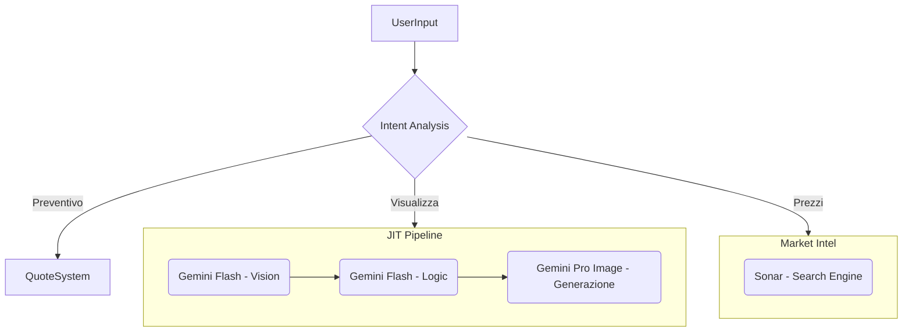

# Configurazione Gemini 2.5 Flash & Imagen - Logica Modelli

Questa documentazione centralizza tutte le impostazioni relative all'utilizzo dei modelli **Gemini** (Chat & Vision), **Imagen** (Generazione) e **Perplexity** (Market Intel) nel progetto di ristrutturazione.

---

## 🎯 Panoramica Architettura

Il sistema utilizza un'architettura ibrida **Multi-Model** che orchestra diversi LLM e modelli generativi in base al compito specifico:



---

## 📦 Modelli Utilizzati

### 1. **Gemini 3 Flash Preview** (Text/Vision)
- **Scopo**: Chatbot (SYD), Analisi Visione, Prompt Engineering (Architect)
- **File di configurazione**: `CHAT_MODEL_VERSION`
- **Default**: `gemini-3-flash-preview`
- **Capacità**: Alta velocità, Multimodal input (Testo + Immagini)

### 2. **Gemini 3 Pro Image Preview** (Multimodal Generative)
- **Scopo**: Image-to-Image renovation (Painter)
- **File di configurazione**: `VISION_MODEL_VERSION`  
- **Default**: `gemini-3-pro-image-preview`
- **Capacità**: Mantiene la geometria strutturale dell'input (ControlNet-like behavior)

### 3. **Imagen 3.0 Generate** (Text-to-Image Fallback)
- **Scopo**: Creazione da zero (Text-to-Image) quando non c'è foto input
- **File di configurazione**: `IMAGEN_MODEL_VERSION`
- **Default**: `imagen-3.0-generate-001`

### 4. **Perplexity Sonar** (Online Search)
- **Scopo**: Analisi prezzi di mercato in tempo reale
- **Modello**: `sonar`
- **Capacità**: Ricerca web live con citazioni (focalizzato sull'Italia)

---

## ⚙️ Variabili d'Ambiente

### File: `web_client/.env`

```env
# Google AI (Chat & Vision)
GEMINI_API_KEY=your-gemini-key
CHAT_MODEL_VERSION=gemini-3-flash-preview
VISION_MODEL_VERSION=gemini-3-pro-image-preview

# Imagen Fallback (Vertex AI)
IMAGEN_MODEL_VERSION=imagen-3.0-generate-001
FIREBASE_PROJECT_ID=your-project-id
FIREBASE_CLIENT_EMAIL=...
FIREBASE_PRIVATE_KEY=...

# Market Intelligence (Perplexity)
PERPLEXITY_API_KEY=pplx-your-key
```

---

## 🔧 Configurazioni per Componente

### A. **Chat API** (`route.ts`)

- **Modello**: `gemini-3-flash-preview`
- **Ruolo**: Orchestratore conversazionale. Decide quando chiamare i tool.
- **Configurazione Streaming**:
  - `maxSteps`: 5 (per permettere ragionamenti complessi)
  - `maxToolRoundtrips`: 2 (Chat -> Tool -> Chat -> User)

### B. **Hybrid Rendering Pipeline** (`ai_core/src/imagen/`)

La pipeline decide dinamicamente quale modello usare:

1.  **Creation Mode (T2I)**:
    -   Utente: "Voglio vedere un salotto moderno" (Nessuna foto)
    -   Modello: `Imagen 3.0 Generate`
    -   Temperatura: Standard

2.  **Renovation Mode (I2I)**:
    -   Utente: Carica foto + "Ristruttura questo bagno"
    -   Modello: `Gemini 3 Pro Image Preview`
    -   Temperatura: **0.2** (Molto bassa per preservare struttura)
    -   **Prompt "Locked"**: Istruzioni geometriche rigide generate dall'Architect.

### C. **Market Intelligence** (`get_market_prices` tool)

-   **Provider**: Perplexity AI
-   **Endpoint**: `https://api.perplexity.ai/chat/completions`
-   **System Prompt**: Forzata la ricerca su domini italiani (.it) e grandi retailer (Leroy Merlin, Iperceramica) per coerenza prezzi.

---

## �️ Sistema di Quote (Rate Limits)

Per gestire i costi e l'abuso, è implementato un sistema di quote a due livelli:

1.  **API Rate Limit (Middleware)**
    -   Limite: 20 richieste / minuto per IP
    -   Gestione: Rifiuto immediato (429 Too Many Requests)

2.  **Tool Quota (Business Logic)**
    -   Gestito in: `ai_core/src/tool-quota.ts`
    -   **Render**: Max 2 generazioni / 24h per IP
    -   **Preventivi**: Max 2 richieste / 24h per IP
    -   **Reset**: Automatico a mezzanotte o dopo 24h (rolling window).

---

## 🧪 Test e Debug

### Comandi Disponibili

```bash
# Test Integrazione Pipeline JIT
npm run test:jit

# Test Quota System
npm run test:quota

# Verifica Modelli Disponibili
npm run debug:models
```

---

## ⚠️ Troubleshooting

### "Perplexity API Error: 401"
- **Causa**: API Key mancante o errata in `.env`
- **Fix**: Verificare `PERPLEXITY_API_KEY`

### "Quota Exceeded" in Chat
- **Causa**: L'IP ha superato il limite di 2 render/preventivi.
- **Fix**: Attendere il reset o cambiare IP (in dev use VPN o restart router).

### "Image generation failed: Blocked"
- **Causa**: Safety filters hanno bloccato l'output.
- **Fix**: I filtri sono impostati su `BLOCK_ONLY_HIGH` per permettere contenuti edili (es. "demolizione"), ma richieste esplicite vengono bloccate.
