# 🐍 Piano di Migrazione: Architecture Split-Stack (Next.js + Python)

## 1. Analisi di Fattibilità & Architettura

### Valutazione Strategica
Passare da una Monolith Next.js a una architettura **Split-Stack (Hybrid)** è la scelta standard per le applicazioni "AI-Native" che scalano oltre la semplice chatbot.

| Pro ✅ | Contro ⚠️ |
| :--- | :--- |
| **Ecosistema AI**: Python ha le librerie first-class per Agents (LangGraph), Vector Search e ML. | **Complessità Infra**: Devi gestire due servizi di deploy separati (Vercel per FE, Cloud Run/Railway per BE). |
| **Stateful Agents**: LangGraph permette di mantenere lo stato complesso (loop, retry, human-in-the-loop) molto meglio di una stateless API route. | **Latenza**: Introduce un "network hop" aggiuntivo (Client -> Next.js -> Python). |
| **Self-Learning**: Implementare RAG e calcolo vettoriale è nativo e performante in Python. | **Auth Sync**: Necessaria sincronizzazione dei token tra due servizi. |

### Flusso Dati (Hybrid Proxy Pattern)

Manteniamo Next.js come **Gateway** e UI, mentre Python diventa il **Cervello**.

```mermaid
sequenceDiagram
    participant U as 👤 User (Browser)
    participant N as ⚡ Next.js API (Proxy/Auth)
    participant P as 🐍 Python API (The Brain)
    participant V as 🧠 Vector DB (Memory)
    participant G as 🤖 Vertex AI (Gemini)

    U->>N: Messaggio Chat + JWT
    Note over N: Valida Token Firebase<br>Rate Limiting
    N->>P: Forward Request (User Input + History)
    
    rect rgb(20, 20, 40)
        Note over P: Inizio Loop LangGraph
        P->>V: 🔍 Ricerca "Errori Passati" (RAG)
        V-->>P: Regole recuperate: "Il gres costa 30€"
        P->>G: Genera Risposta (Streaming) con Regole
        G-->>P: Stream Token
    end
    
    P-->>N: Stream Response
    N-->>U: Stream UI (Vercel AI SDK)
    
    rect rgb(50, 20, 20)
        Note over U: Utente corregge: "No, costa 40!"
        U->>N: Feedback Negativo
        N->>P: API /learn (Background Task)
        P->>V: Embed & Save "Nuova Regola"
    end
```



### Gestione Autenticazione (Internal JWT Handshake)
Per massimizzare sicurezza e performance (evitando la doppia validazione 200ms+ di Firebase in Python):

1.  **Next.js (Edge)**: Valida `ID_TOKEN` Firebase. Genera un **Internal JWT** firmato (HMAC-SHA256) con secret condiviso `INTERNAL_JWT_SECRET` (validità 60s).
2.  **Next.js -> Python**: Invia richiesta con `Authorization: Bearer <internal_token>`.
3.  **Python**: Valida solo la firma dell'Internal JWT (~1ms).
4.  **Sicurezza**: Il backend Python rifiuta qualsiasi richiesta senza token interno valido, blindandolo da accessi pubblici non autorizzati.

---

## 2. Stack Tecnologico Consigliato

Per replicare e superare le funzioni attuali ("SYD" Il Cervello):

### Framework & Runtime
*   **Web Framework**: **FastAPI**. Standard de-facto, async nativo, performance elevate, documentazione automatica.
*   **Server**: **Uvicorn** (ASGI).

### Orchestration & AI
*   **Agent Framework**: **LangGraph**. Ideale per flussi ciclici ("Reflect", "Correct") e persistenza dello stato. Supera LangChain standard per la gestione di agenti complessi.
*   **SDK AI**: `langchain-google-vertexai`. Supporto first-class per Gemini Pro e Function Calling.

### Memory & Vector DB
*   **Vector DB**: **Pinecone** (Serverless).
    *   *Perché?* Non richiede gestione infrastruttura (a differenza di Chroma/Weaviate self-hosted), scalabile, tier gratuito generoso.
*   **Embedding Model**: `vertex-embedding-multilingual` (Google) per coerenza semantica.

---


## 3. Roadmap di Implementazione

### Fase 1: Setup "Exo-Cortex" (Backend Esterno)
*   [ ] Inizializzare repo `backend_python/` con `uv` (Rust-based package manager).
*   [ ] Setup FastAPI + Uvicorn con `INTERNAL_JWT_SECRET`.
*   [ ] **Security**: Implementare `verify_internal_token` middleware (JWT Check).
*   [ ] **Security**: Configurare Payload Limits (4MB JSON) nel Proxy Next.js.
*   [ ] Creare endpoint base `POST /chat` che risponde in streaming (mock).
*   [ ] Dockerfile per deploy su Google Cloud Run (min-instances=1).

### Fase 2: Porting dei Tool (La Lobotomia controllata)
*   [ ] Porting `generate_render`: Riscrittura logica Vertex AI Imagen in Python.
*   [ ] Porting `get_market_prices`: Integrazione `perplexity-client`.
*   [ ] Setup LangGraph: Creare il grafo base `Input -> Agent -> Tools -> Output`.

### Fase 3: Il "Self-Learning" (RAG Loop)
*   [ ] Setup Pinecone Index `renovation-knowledge`.
*   [ ] Implementare endpoint `POST /learn`:
    *   Input: "Il gres non costa 10€ ma 30€".
    *   Action: LLM estrae regola -> Embedding -> Upsert in Pinecone.
*   [ ] Modificare il grafo LangGraph:
    *   Step 0: Retrieve da Pinecone.
    *   Step 1: Inject "Known Errors" nel System Prompt.

### Fase 3.5: Dynamic Pricing Engine (Il Preventivatore Intelligente)
*   **Obiettivo**: Creare preventivi che imparano dai dati reali.
*   **Logica "Weighted RAG"**:
    1.  **Storage**: Pinecone indice separato `pricing-memory`.
    2.  **Schema**: `{ work: "posa gres", price: 45, unit: "mq", source: "human|ai", weight: 1.0|0.5 }`.
    3.  **Generation**:
        *   Query Vector DB per lavori simili.
        *   Calcolo Media Pesata: `(Prezzo_Reale * 1.0 + Prezzo_AI * 0.5) / Totale_Pesi`.
        *   **Fallback**: Se non ci sono dati storici -> Chiama Perplexity.
    4.  **Feedback**: Quando un preventivo diventa "Contratto Reale", viene salvato con `weight: 1.0` (Gold Standard).

### Fase 4: Integrazione Frontend (Il Trapianto)
*   [ ] Modificare `web_client/app/api/chat/route.ts`.
*   [ ] Invece di chiamare `streamText` (Node), farà una chiamata `fetch` allo stream FastAPI.
*   [ ] Adattare il formato risposta streaming per Vercel AI SDK.

---

## 4. Esempio di Codice (Proof of Concept)

Ecco come appare un endpoint FastAPI moderno con RAG Self-Learning e Streaming.

### `main.py`

```python
import os
from typing import List, AsyncIterable
from fastapi import FastAPI, Header, HTTPException, Depends
from pydantic import BaseModel
from langchain_google_vertexai import ChatVertexAI, VertexAIEmbeddings
from langchain_pinecone import PineconeVectorStore
from langchain_core.prompts import ChatPromptTemplate
from langchain_core.output_parsers import StrOutputParser
from langgraph.graph import StateGraph, END

# Configurazione
app = FastAPI()
MODEL_NAME = "gemini-1.5-pro-preview-0409"
PINECONE_INDEX = "syd-memory"

# Modelli Pydantic
class ChatRequest(BaseModel):
    messages: List[dict] # {role: string, content: string}
    sessionId: str

# 1. Setup AI & Memory Components
embeddings = VertexAIEmbeddings(model_name="text-embedding-004")
vector_store = PineconeVectorStore(
    index_name=PINECONE_INDEX, 
    embedding=embeddings
)
# Retriver specializzato in "Regole Correzzionali"
retriever = vector_store.as_retriever(search_kwargs={"k": 3})

llm = ChatVertexAI(
    model_name=MODEL_NAME,
    temperature=0.3, # Bassa per seguire le regole
    streaming=True
)

# 2. Logic: Self-Correction Retrieval
async def get_learned_rules(query: str) -> str:
    """Recupera lezioni apprese dagli errori passati."""
    docs = await retriever.ainvoke(query)
    if not docs:
        return ""
    rules = "\n".join([f"- {d.page_content}" for d in docs])
    return f"\n\n[MEMORIA ERRORI PASSATI - NON RIPETERE]:\n{rules}"

# 3. Endpoint Chat
@app.post("/chat/stream")
async def stream_chat(
    request: ChatRequest, 
    authorization: str = Header(None)
):
    # (Qui andrebbe la verifica token Firebase)
    if not authorization: 
        raise HTTPException(401, "Missing Auth")

    # Estrai l'ultimo messaggio utente
    last_user_msg = request.messages[-1]["content"]

    # STEP A: RAG (Recupera regole apprese)
    learned_context = await get_learned_rules(last_user_msg)

    # STEP B: Costruisci il prompt dinamico
    system_prompt = f"""
    Sei SYD, un architetto AI.
    
    {learned_context}
    
    Rispondi all'utente professionalmente.
    """

    # Prepare messages for LangChain
    lc_messages = [("system", system_prompt)]
    for msg in request.messages:
        lc_messages.append((msg["role"], msg["content"]))

    # STEP C: Streaming Generator
    async def generate_event_stream() -> AsyncIterable[str]:
        # Formato Vercel AI SDK Data Protocol
        async for chunk in llm.astream(lc_messages):
            if chunk.content:
                # 0:Text format per Vercel AI SDK Protocol v1
                # In produzione usare librerie di adapter migliori
                yield f'0:"{chunk.content}"\n'
    
    from fastapi.responses import StreamingResponse
    return StreamingResponse(
        generate_event_stream(), 
        media_type="application/x-ndjson" # Richiesto da Vercel AI SDK
    )

# 4. Endpoint Apprendimento (Feedback Loop)
class LearningRequest(BaseModel):
    correction: str # es: "Il prezzo del parquet non è 10 ma 50"

@app.post("/learn")
async def learn_from_feedback(feedback: LearningRequest):
    # Inserisce la correzione nel DB Vettoriale
    # Usando l'embedding della frase stessa come chiave semantica
    await vector_store.aadd_texts(
        texts=[feedback.correction],
        metadatas=[{"source": "user_correction", "timestamp": "..."}]
    )
    return {"status": "Rule memorized"}
```

### Prossimi Step
Se sei d'accordo con questo piano, posso creare la directory `backend_python` e iniziare con la **Fase 1 (Setup & Hello World)**.
